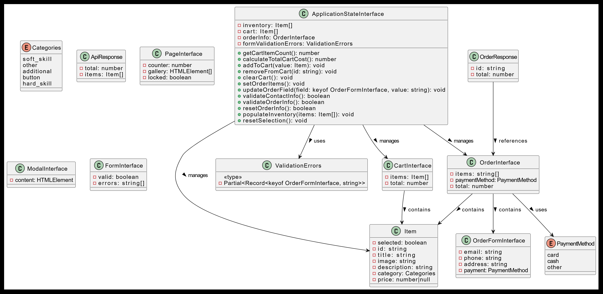

# Проектная работа "Веб-ларек"

Стек: HTML, SCSS, TS, Webpack

Структура проекта:

- src/ — исходные файлы проекта
- src/components/ — папка с JS компонентами
- src/components/base/ — папка с базовым кодом

Важные файлы:

- src/pages/index.html — HTML-файл главной страницы
- src/types/index.ts — файл с типами
- src/index.ts — точка входа приложения
- src/scss/styles.scss — корневой файл стилей
- src/utils/constants.ts — файл с константами
- src/utils/utils.ts — файл с утилитами

## Установка и запуск

Для установки и запуска проекта необходимо выполнить команды

```
npm install
npm run start
```

или

```
yarn
yarn start
```

## Сборка

```
npm run build
```

или

```
yarn build
```

# Документация проекта Веб ларёк

## Типы и интерфейсы

### Типы

- **Categories**: Перечисление категорий товаров, доступных в магазине:

  - `софт-скил`
  - `другое`
  - `дополнительное`
  - `кнопка`
  - `хард-скил`

- **CategoryMapping**: Сопоставление категорий с их строковыми представлениями.

- **ValidationErrors**: Ошибки валидации, представленные как частичное сопоставление полей формы заказа с сообщениями об ошибках.

- **PaymentMethod**: Перечисление доступных методов оплаты:

  - `карта`
  - `наличные`
  - `платежная система`
  - `криптовалюта`
  - `бартер`
  - `крышки`
  - `иное`

- **PaymentMapping**: Сопоставление методов оплаты с их строковыми представлениями.

### Интерфейсы

- **ApiResponse**: Интерфейс для ответа API, содержащий массив элементов.
  - **Свойства**:
    - `items: Item[]`: Массив товаров.

- **ApplicationState**: Интерфейс для описания внутреннего состояния приложения.
  - **Свойства**:
    - `inventory: Item[]`: Массив карточек товара.
    - `cart: Item[]`: Товары в корзине.
    - `orderInfo: Order`: Информация о заказе.
    - `formValidationErrors: ValidationErrors`: Ошибки валидации.
  - **Методы**:
    - `getCartItemCount(): number`: Возвращает количество товаров в корзине.
    - `calculateTotalCartCost(): number`: Вычисляет общую стоимость товаров в корзине.
    - `addToCart(value: Item): void`: Добавляет товар в корзину.
    - `removeFromCart(id: string): void`: Удаляет товар из корзины по ID.
    - `clearCart(): void`: Очищает корзину полностью.
    - `setOrderItems(): void`: Добавляет ID товаров в поле items для orderInfo.
    - `updateOrderField(field: keyof OrderForm, value: string): void`: Обновляет поля заказа.
    - `validateContactInfo(): boolean`: Проверяет корректность контактной информации.
    - `validateOrderInfo(): boolean`: Проверяет корректность деталей заказа.
    - `resetOrderInfo(): boolean`: Сбрасывает orderInfo после завершения покупки.
    - `populateInventory(items: Item[]): void`: Преобразует данные с сервера в формат приложения.
    - `resetSelection(): void`: Сбрасывает поле isSelected у всех товаров после покупки.

- **User ContactInfo**: Интерфейс для описания контактной информации пользователя.
  - **Свойства**:
    - `email: string`: Электронная почта пользователя.
    - `phoneNumber: string`: Номер телефона пользователя.

- **Order**: Интерфейс для описания заказа.
  - **Свойства**:
    - `items: string[]`: Массив идентификаторов купленных товаров.
    - `paymentMethod: PaymentMethod`: Метод оплаты для заказа.
    - `totalCost: number`: Общая стоимость заказа.
    - `deliveryAddress: string`: Адрес доставки для заказа.

- **OrderForm**: Интерфейс для описания формы заказа.
  - **Свойства**:
    - `paymentMethod: PaymentMethod`: Метод оплаты для заказа.
    - `deliveryAddress: string`: Адрес доставки для заказа.

- **Item**: Интерфейс для определения свойств товара в магазине.
  - **Свойства**:
    - `idItem: string`: ID товара.
    - `titleItem: string`: Название товара.
    - `imageItem: string`: Ссылка на изображение товара.
    - `descriptionItem: string`: Описание товара.
    - `categoryItem: Categories`: Категория товара.
    - `costItem: number`: Цена товара.
    - `isItemSelected: boolean`: Указание на то, выбран ли товар.
### Схема
